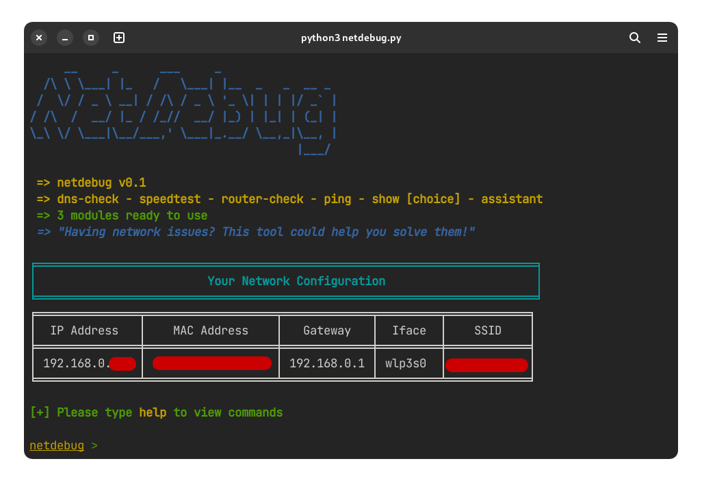

# NetDebug

### This is a project to help you solve common network issues and has other network-related tools.



Available commands / modules:

| No. | Command | Description |
| --- | --- | --- |
| 1 | show | Show network data of choice (or select from menu) |
| 2 | dns-check | Run a DNS check by pinging DNS servers |
| 3 | router-check | Run a router check by pinging the gateway (router) |
| 4 | ping | Run a ping check by pinging the specified address or IP |
| 5 | assistant | Solve your network issues with the help of the NetDebug Assistant! |
| 6 | speedtest | Run a network speed test using Ookla Speedtest |

#### NOTE:
- This is a work-in-progress project. Surely many things can be improved here and there, so feel free to open an issue about it.
- If something doesn't work on your platform, please feel free to open an issue about it.
- This project is made targeted for Linux platform. So there it might not work on other platforms. It might work on macOS with some changes.

Install required `pip` packages:

```
pip install simple-colors tabulate
```

### How to get started:

1. Make sure you have the required package installed.
- You need `speedtest` (https://www.speedtest.net/apps/cli) installed on your system.

2. Clone the repository (recommended):
```sh
$ git clone https://github.com/ArcticDev78/NetDebug.git
```
- OR you can Download the ZIP by clicking on Code > Download ZIP

3. Running netdebug
- You can directly run the python file:
```sh
$ python3 netdebug.py
```
